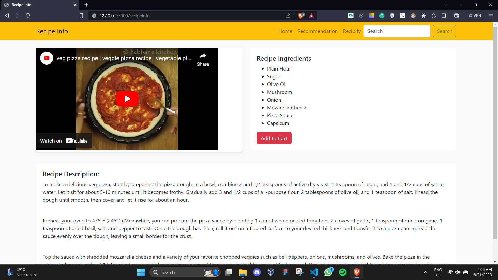
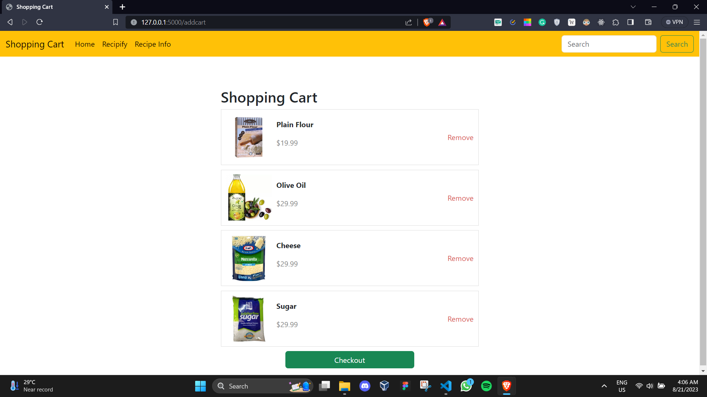

<!--Banner-->

# FlipMart - A Personalized Product Recommender by Binary Coders</b>
Flipsmart is an attempt to bring the features to life of the robust and popular E-Commerce application - FlipMart. This project was built as a part of the Flipkart GRID 5.0 where we build our project on a Problem Statement: Personalized Product Recommendations

<b> What does this project solves: </b><br/>
#### 1. Recommending items based on Past Purchase History
- There is a repetition that happens while buying grocery items and a user's past purchase history is extremely crucial for offering good recommendations. 
- For recommendations on the past order, there is a need for an association between the current item and the previously bought items. The Apriori Algorithm of ARL is used to find the association among products.

#### 2. Recommending items based on ratings from Similar Users
- People from the same region have similar staple food and dietary habits hence having similar product needs became the basis for us taking up this use case.
- To find the required similarities between the users, the Memory-based Collaborative filtering technique was used by implementing the nearest neighbors algorithm thereby identifying similar users with the common trends using the user rating data.

# Table of contents

- [Screenshots](#screenshots)
- [Installation](#installation)
- [Support and Contact](#support-and-contact)

# Screenshots

### Homepage 


### Recommendation Page


### Recipify Page


### RecipeInfo Page 



### Shopping Cart Page 


# Installation 
To use this project, follow the steps below:

Initialize git on your terminal.

```bash
git init https://github.com/aman-chhetri/FlipMart.git
```
Clone this repository.

```bash
python app.py
``` 

That's it! Your application is good to go. 

# Support and Contact 📩

Project made by: [@amankshetri](https://www.linkedin.com/in/amankshetri/) , [@amanbhandari](https://www.linkedin.com/in/amankshetri/) and [@rajsahrauniyar](https://www.linkedin.com/in/amankshetri/)  - feel free to contact us! 🙂
